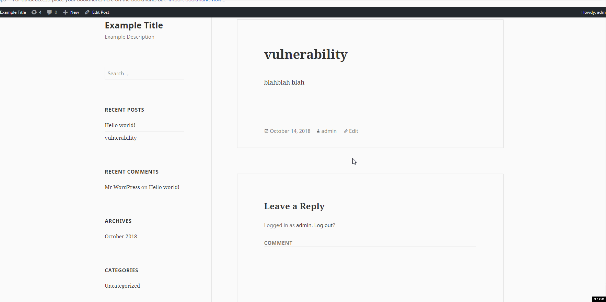
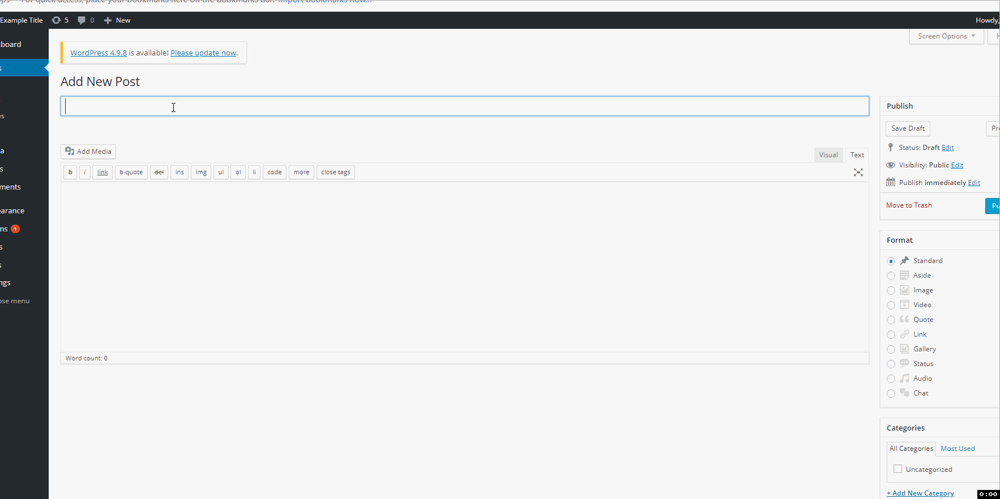
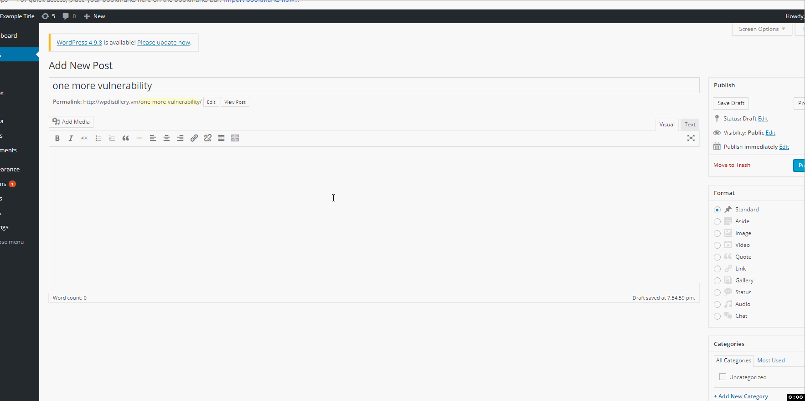

# Codepath Week 7 - WordPress Pentesting

Time spent: **3** hours spent in total

> Objective: Find, analyze, recreate, and document **three vulnerabilities** affecting an old version of WordPress

## Pentesting Report

1. **Cross-Site Scripting (XSS) in a comment**
  - [x] Summary: 
  - Any user can insert a <script> tag into a comment.
  
  - *WordPress version*: **4.2**
    
  - [x] **GIF Walkthrough**: 

  
  - [x] **Steps to recreate**:
- 1. Reply to a post.
- 2. Create a script in the text box.
- 3. Submit the comment. 
- Now, anyone who clicks on the post will activate the script.
  
 - [WordPress Version History](https://core.trac.wordpress.org/browser/tags/version/src/source_file.php)

2. **Stored Cross-Site Scripting (XSS)**
  - [x] **Summary**: 
  - Any user that can create a post can insert HTML containing JavaScript.
  
  - *WordPress version*: **4.2**
    
  - [x] **GIF Walkthrough**: 
  

  - [x] **Steps to recreate**:
- 1. Create a new post
- 2. Change the mode from "visual" to "text."
- 3. Insert this ( <a href="[caption code=">]</a><a title=" onmouseover=alert('loser')  ">link</a> ) into the text box. (You can change "loser" to a different word.)
- Now, anyone who scrolls over the link will activate it, and be told that they are a loser.
  
 - [WordPress Version History](https://core.trac.wordpress.org/browser/tags/version/src/source_file.php)

3. **YouTube URL Embed**
  - [x] **Summary**: 
  - Any user that can create a post can embed this YouTube URL when creating a post.
  
  - *WordPress version*: **4.2**
    
  - [x] **GIF Walkthrough**: 
    
  
  - [x] **Steps to recreate**:
- 1. Create a new post.
- 2. Change the mode from "visual" to "text." 
- 3. Insert this embedded YouTube URL: ( [embed src='https://youtube.com/embed/123\x3csvg onload=alert(1)\x3e'][/embed] )
- Now, anyone who visits the post will activate the pop-up.
  
 - [WordPress Version History](https://core.trac.wordpress.org/browser/tags/version/src/source_file.php)

## Resources

- [WordPress Source Browser](https://core.trac.wordpress.org/browser/)
- [WordPress Developer Reference](https://developer.wordpress.org/reference/)

- [KALI](https://www.kali.org/about-us/) was used to find the vulnerabilities in WordPress version 4.2
- GIFs created with [LiceCap](http://www.cockos.com/licecap/)

